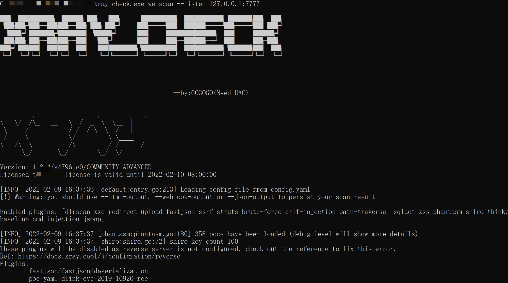

# xray_free_crack

## 说明

1.原破解文章地址:https://mp.weixin.qq.com/s/KfPIPHSjK815G_IXKtcImQ

2.原理很简单就是修改系统时间为证书到期前,运行了xray后再把系统时间设置为正常.

3.修改系统时间需要UAC权限,所以得用管理员运行.

4.只弄了windows的,需要其他版本的请自行修改.(有时候不知道怎么回事,改不了时间,系统问题~~)

Ps:请自行去往xray官网下载最新版xray,和编译后的文件放一起(ps:证书文件不能忘),重命名为xray.exe

目前支持最新版本:1.8.4
2022.05.16
## 编译

```go
go 1.17
go get golang.org/x/text/encoding/simplifiedchinese
CGO_ENABLED=0 GOOS=windows GOARCH=amd64 go build -o xray_crack.exe -ldflags "-w -s" --trimpath xray.go
```


